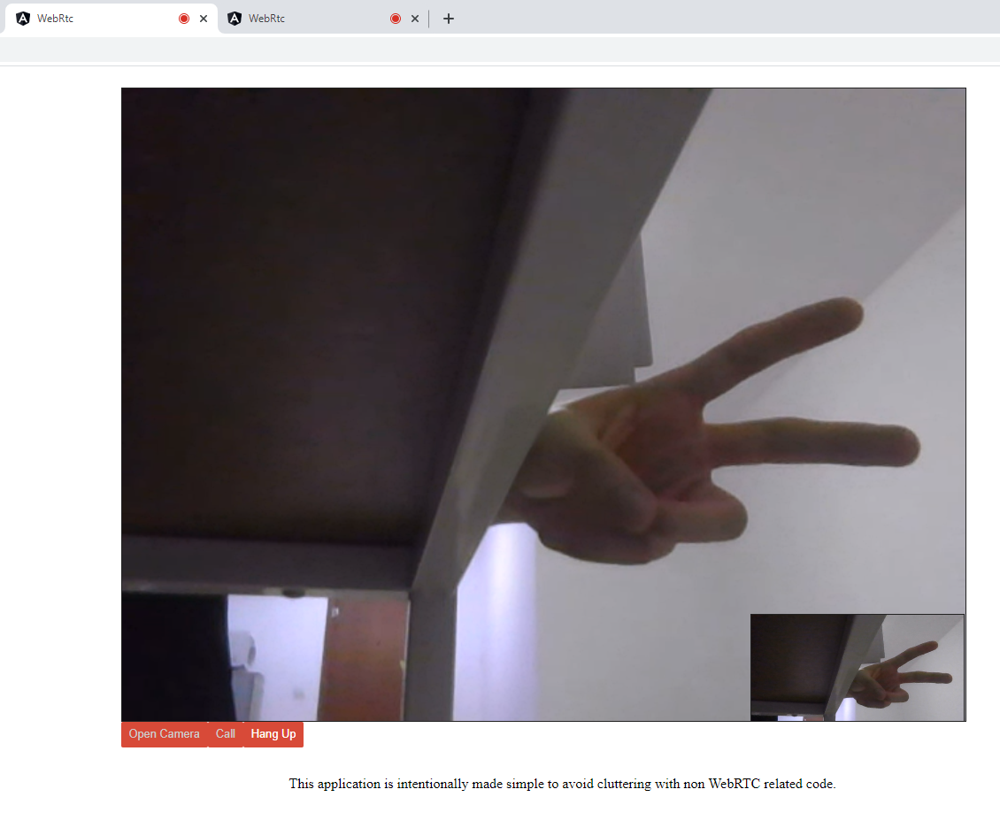

# WebRtc-angular

Practice demo for rtc feature of [Kahla](https://github.com/AiursoftWeb/Kahla.App)

## Get started

「You need to Build a websocket server like 'ws://localhost:64072/socket' Simultaneously. You can use [WebSocketServer-dotnet](https://github.com/MESOLONELY/WebSocketServer-dotnet) as the server」

Run `ng serve`

## Samples

